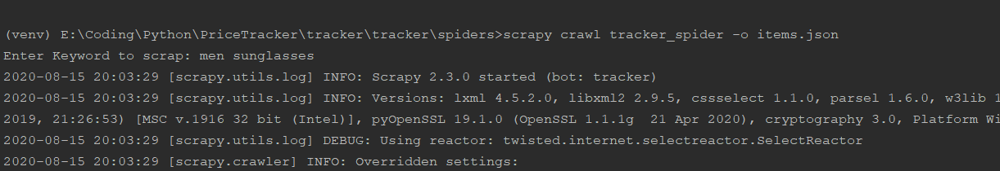
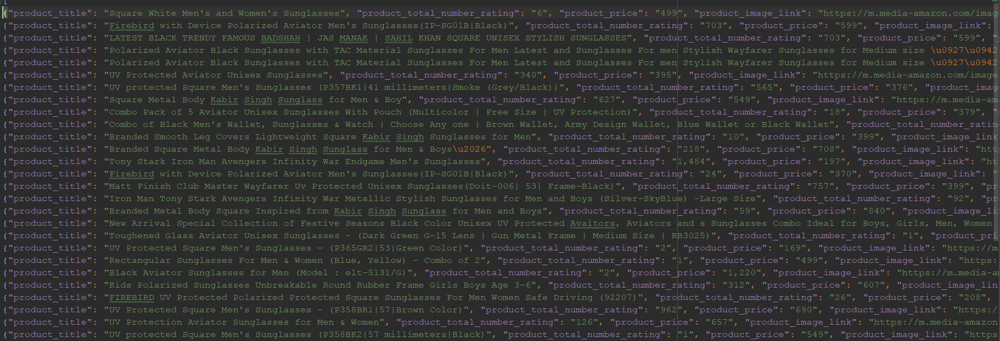

# PriceTracker

To install all python modules required
pip install -r requirements.txt

Change directory to \tracker\spiders>

scrapy crawl tracker_spider -o <filename>.<format>
scrapy crawl tracker_spider -o items.json

To run tracker

Then enter the keyword to track
eg:

And check the result in the file mentioned above which will be crated in \tracker\spiders> directory..

# Output will look like 

